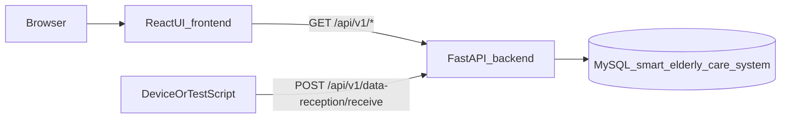
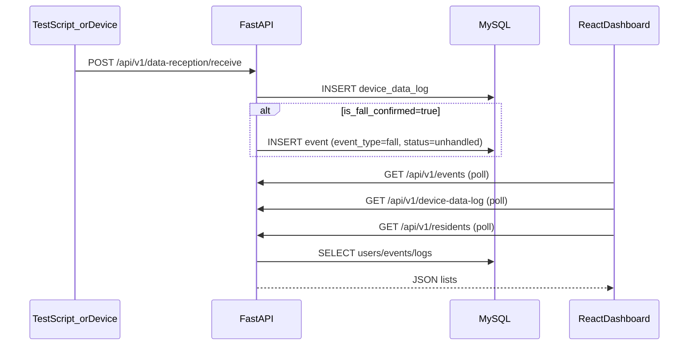

# Proactive Guardian Care (Final Year Project)

Smart wearable + dashboard prototype for elderly-care homes.

- **Primary demo UI**: [`frontend/`](frontend/) (React + Vite + TypeScript, port 5173)
- **Backend API**: [`backend/backend/`](backend/backend/) (FastAPI, port 8000)
- **Database**: MySQL schema + seed data in [`database/mysql/Dump20260426.sql`](database/mysql/Dump20260426.sql) (`smart_elderly_care_system`)
- **Legacy/optional UIs**:
  - [`backend/forntend/`](backend/forntend/) — optional admin CRUD UI (Vite/React, port 3000)
  - [`frontend/web-dashboard/`](frontend/web-dashboard/) — legacy static dashboard (no `package.json` scripts)

## Docs

- [`docs/SETUP.md`](docs/SETUP.md) — setup (incl. DB import)
- [`docs/DEMO.md`](docs/DEMO.md) — demo script + expected results
- [`docs/ARCHITECTURE.md`](docs/ARCHITECTURE.md) — implemented vs planned (PDF-cited)
- [`docs/TROUBLESHOOTING.md`](docs/TROUBLESHOOTING.md)
- [`docs/README.md`](docs/README.md) — docs index

## Executive summary (≤10 lines)

This project proposes a “Proactive Guardian Care” platform for nursing homes: a wearable (falls/vitals/location) plus a dashboard to surface alerts and resident status (`Project_Proposal_Grp_10.pdf`, p.1; `Initial_Report_Grp_10.pdf`, pp.25–27).  
In this repo, the **implemented prototype** is a FastAPI + MySQL backend with CRUD endpoints plus a React dashboard that reads from `/api/v1/*`.  
Features like **geofence breach monitoring** and **push notifications** are described in the PDFs but are **not fully implemented** in this repo (see “Planned (from PDFs)” in [`docs/ARCHITECTURE.md`](docs/ARCHITECTURE.md)).

## Quick start (shortest working path)

### Prereqs

- **Node.js**: CI uses Node 20 (`.github/workflows/ci-frontend.yml`)
- **Python**: CI uses Python 3.11 (`.github/workflows/ci-backend.yml`)
- **MySQL**: required for backend `/api/v1/*` (schema in `database/mysql/Dump20260426.sql`)

### Terminal 1 — Backend (FastAPI)

```bash
cd backend/backend
pip install -r requirements.txt
python -m uvicorn app.main:app --host 0.0.0.0 --port 8000 --reload
```

- Health: `http://localhost:8000/health`
- API docs: `http://localhost:8000/docs`

### Terminal 2 — Frontend (primary demo UI)

```bash
cd frontend
npm install
npm run dev
```

- Open: `http://localhost:5173`
- Backend base URL is hard-coded in [`frontend/src/constants/backend.ts`](frontend/src/constants/backend.ts) (no `import.meta.env` support).

## Demo in 90 seconds

1. Open the dashboard at `http://localhost:5173`.
2. Click **Location** in the top nav to show the indoor floorplan map.
   - Code: [`frontend/src/components/LocationDashboard.tsx`](frontend/src/components/LocationDashboard.tsx)
3. Trigger a fall payload (backend):

```bash
cd backend/backend
python test_data_reception.py
```

4. In the UI, open **Admin → Device Logs** and **Admin → Events** to see new rows.
   - Routes: `GET /api/v1/device-data-log/`, `GET /api/v1/events/`
5. Optional: click **Simulate new data**, then **Exit demo mode** (frontend-only demo overlay).
   - Code: [`frontend/src/App.tsx`](frontend/src/App.tsx), [`frontend/src/shared/resident-live-store.tsx`](frontend/src/shared/resident-live-store.tsx)

## Features (implemented — linked to code)

- **FastAPI routers (`/api/v1/*`)**: [`backend/backend/app/api/routes/`](backend/backend/app/api/routes/)
- **DB schema + seed**: [`database/mysql/Dump20260426.sql`](database/mysql/Dump20260426.sql)
- **Residents aggregation**: `GET /api/v1/residents/` in [`backend/backend/app/api/routes/residents.py`](backend/backend/app/api/routes/residents.py)
- **Data reception**: `POST /api/v1/data-reception/receive` in [`backend/backend/app/api/routes/data_reception.py`](backend/backend/app/api/routes/data_reception.py)
- **Auto-create fall events** when `is_fall_confirmed=true`:
  - Logic: [`backend/backend/app/crud/device_data_log.py`](backend/backend/app/crud/device_data_log.py)
  - Output: inserts into `event` table (`event_type='fall'`, `event_status='unhandled'`)
- **React dashboard (primary UI)**:
  - App shell: [`frontend/src/App.tsx`](frontend/src/App.tsx)
  - Backend API client: [`frontend/src/services/api.ts`](frontend/src/services/api.ts)
  - Admin tabs: [`frontend/src/components/admin/AdminSection.tsx`](frontend/src/components/admin/AdminSection.tsx)
  - Indoor map: [`frontend/src/components/LocationDashboard.tsx`](frontend/src/components/LocationDashboard.tsx)

## Architecture

### Implemented (repo)





### Planned (from PDFs — not fully implemented in repo)

See [`docs/ARCHITECTURE.md`](docs/ARCHITECTURE.md) with citations to:
- `Initial_Report_Grp_10.pdf` pp.25–27 (functional requirements)

## Repo structure

```text
.
├─ backend/
│  ├─ requirements.txt
│  ├─ backend/                 # FastAPI app root
│  └─ forntend/                # Optional admin CRUD UI
├─ database/
│  ├─ mysql/
│  │  └─ Dump20260426.sql
│  └─ mongo/
├─ frontend/                   # Primary demo UI (React/Vite)
├─ docs/                       # Runbooks + design docs
├─ firmware/                   # PlatformIO project (scaffold)
├─ infra/                      # docker-compose scaffold (not verified end-to-end)
└─ ai/                         # notebooks/service placeholders
```

## Configuration

### Backend env vars

Backend reads `.env` via `backend/backend/app/config.py` (pydantic-settings).

- `.env` present: [`backend/backend/.env`](backend/backend/.env)
- Template: [`backend/backend/.env.example`](backend/backend/.env.example)

### Frontend backend URL

The frontend does **not** use `import.meta.env` today. Update:

- [`frontend/src/constants/backend.ts`](frontend/src/constants/backend.ts)

## Troubleshooting (grounded)

- **Health check**: use `/health` (this repo does not implement `/healthz`).
- **Empty residents list**: ensure MySQL is running and schema is loaded (`database/mysql/Dump20260426.sql`).
- **`POST /api/v1/data-reception/receive` returns “设备不存在”**: the `device_id` must exist in `device` table.
- **Fall event not auto-created**: `device.elderly_user_id` must not be `NULL`.

More: [`docs/TROUBLESHOOTING.md`](docs/TROUBLESHOOTING.md).

## Roadmap (PDF-aligned)

- Requirements baseline: `Initial_Report_Grp_10.pdf` pp.25–27 (Section 4.1)
- Milestones schedule: `Initial_Report_Grp_10.pdf` p.35 (Section 5.2)
- Roles: `Initial_Report_Grp_10.pdf` pp.36–38 (Section 5.3)

## AI-assisted development

Cursor plan artifacts used as working notes (with human verification against code/routes):
- `C:\\Users\\user\\.cursor\\plans\\dashboard_map_&_geofence_79d7c0ae.plan.md`
- `C:\\Users\\user\\.cursor\\plans\\indoor_map_demo_update_26aafa99.plan.md`
- `C:\\Users\\user\\.cursor\\plans\\demo_exit_polygons_3609eb22.plan.md`
- `C:\\Users\\user\\.cursor\\plans\\ui_optimization_plan_2b703f14.plan.md`

## Where to add meeting notes / log sheets

No meeting/chat logs were found in the repo. Suggested location:

- `docs/MEETINGS.md` (template) or `docs/NOTES/` for weekly logs

## License

See [`LICENSE`](LICENSE). Academic prototype — not medical advice.
