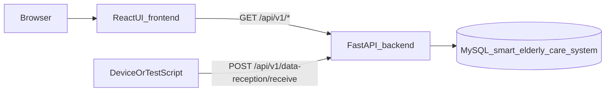
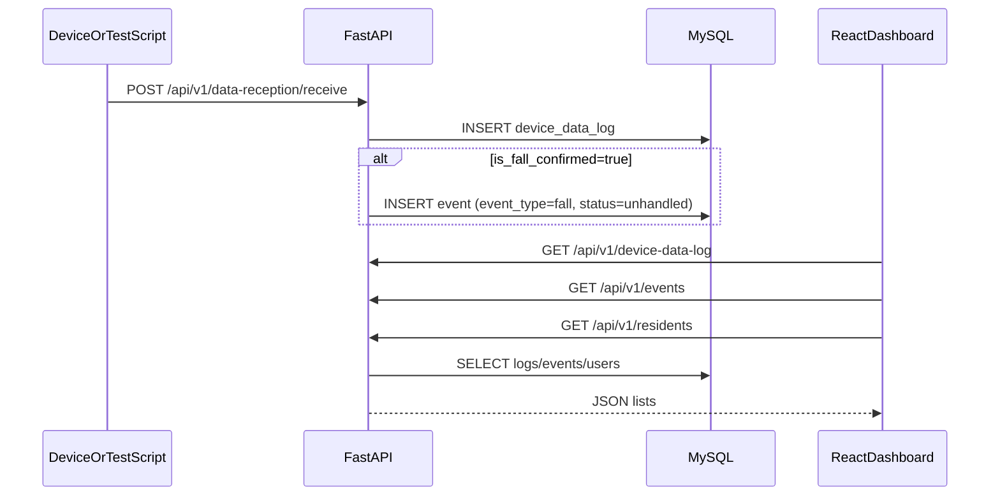

# Architecture

This document separates what is implemented in the repo from what is planned in the PDFs.

## Implemented (repo)

### Components

Evidence pointers:
- Frontend base URL + API prefix: `frontend/src/constants/backend.ts`
- FastAPI entry: `backend/backend/app/main.py`
- Routers: `backend/backend/app/api/routes/__init__.py`
- DB schema: `backend/Dump20251120.sql`

### Implemented fall pipeline

Evidence pointers:
- Route: `backend/backend/app/api/routes/data_reception.py`
- Auto-event creation: `backend/backend/app/crud/device_data_log.py`
- Test script: `backend/backend/test_data_reception.py`

## Planned (from PDFs, not fully implemented in repo)

The Initial Report lists functional requirements such as indoor localization, outdoor geofence breach alerts, and caregiver notifications (`Initial_Report_Grp_10.pdf`, pp.25-27).

## Infra status (repo)

The `infra/` folder contains a docker-compose scaffold, but it is not aligned with the current backend:
- compose DB: Postgres/Timescale (`infra/docker-compose.dev.yml`)
- backend implemented DB: MySQL (`backend/backend/app/config.py`)
- compose expects `DATABASE_URL`, but backend uses `DB_HOST`, `DB_USER`, etc

For a runnable demo stack, use `docker-compose.demo.yml` at repo root.
